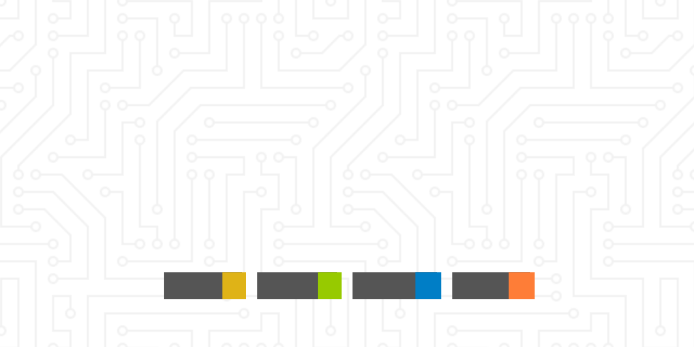

<div align=center>
    
</div>

<div align=center>
    
    
    
    
</div>

# Goopper 前端

## 简介

这是 Goopper 的前端代码仓库。

## 安装指南

```bash
# 克隆仓库
git clone https://github.com/Goopper/platform-frontend
# 进入项目目录
cd platform-frontend
# 安装依赖
pnpm install
```

## 快速开始

```bash
# 运行项目
npm start
```

## 许可证

本项目采用 [MIT 许可证](LICENSE)
